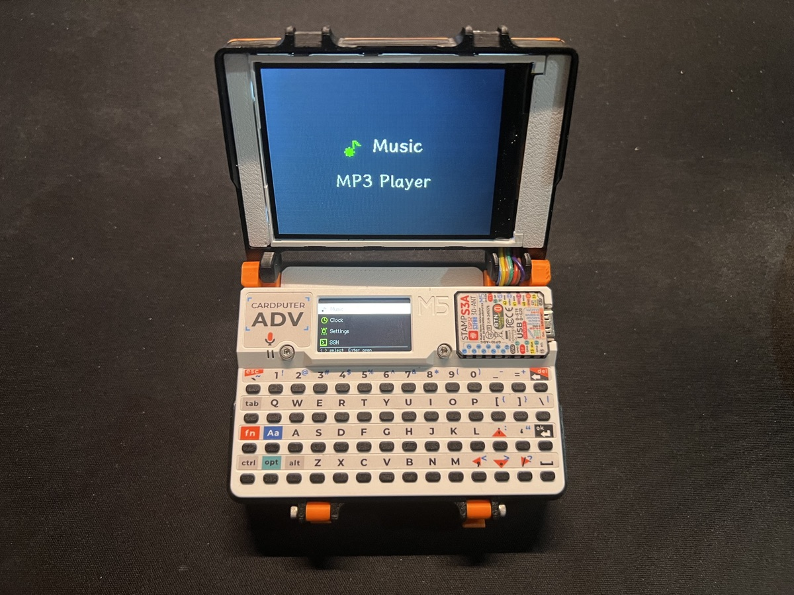
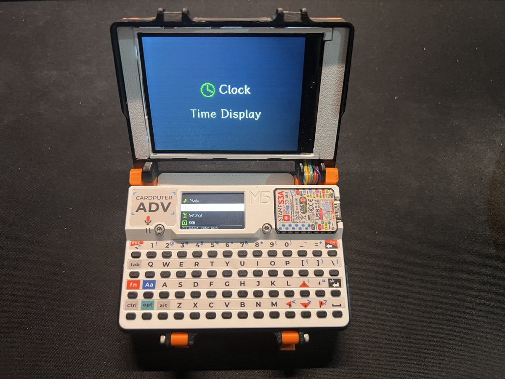
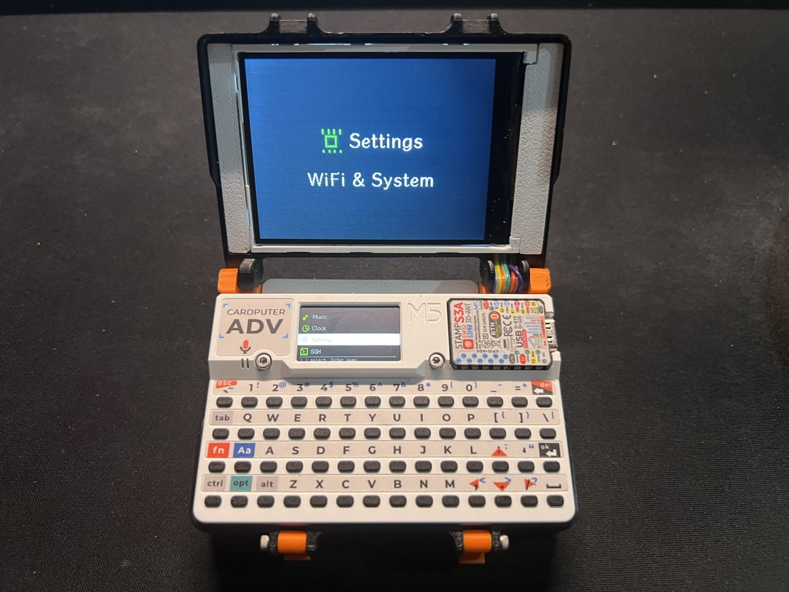
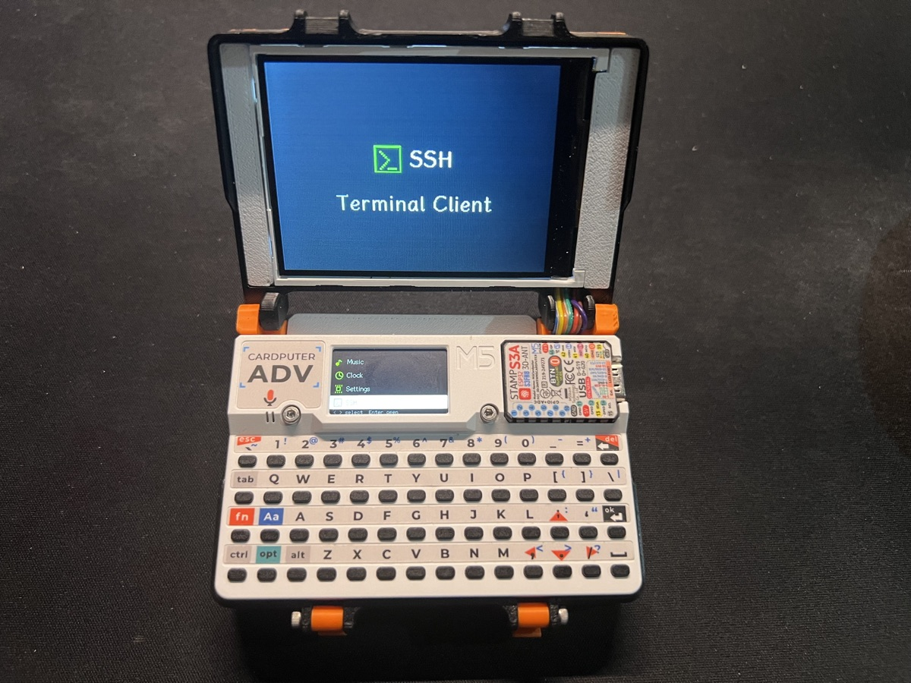
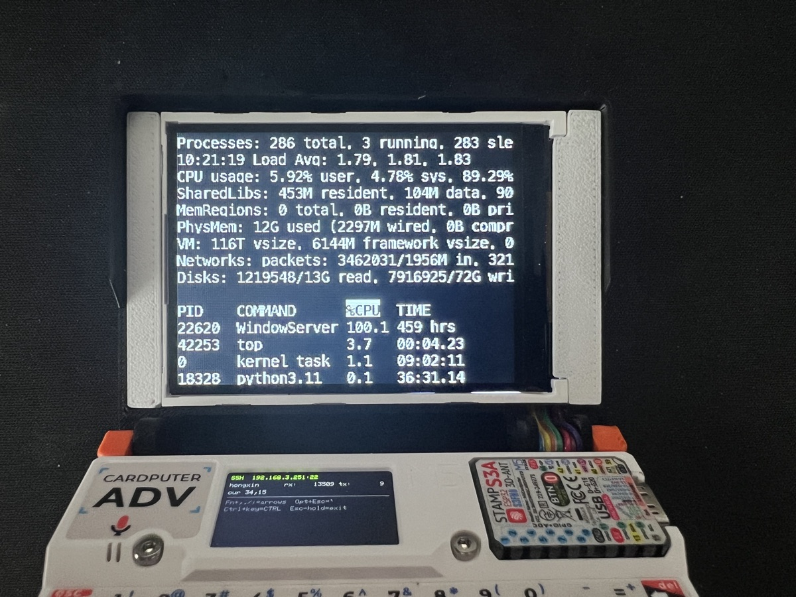
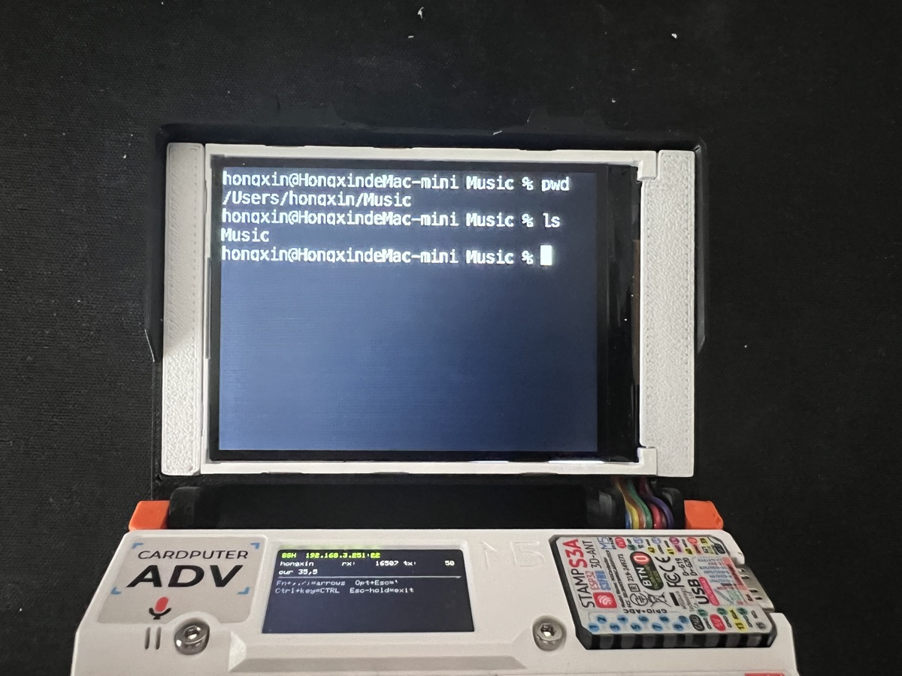

# XZYOS · 小璋瑜OS

> **Made by Tim** · v0.6.0
> Cardputer ADV 掌上双屏终端：SSH 远程登录 + VT100 中文终端 + MP3 播放器 + 农历时钟








## 功能

| 模块 | 内容 |
|---|---|
| **SSH 终端** | 完整 SSH2 客户端（自实现协议栈，curve25519 + AES128-CTR + HMAC-SHA2-256） |
| | 外接 320×240 ILI9341 大屏 40×15 VT100 终端（16 色 ANSI + 中文点阵 + 光标闪烁） |
| | 密码认证 · NVS 持久化配置 · 流控窗口 · 长按连发（退格连删 / 方向键连移） |
| | 实测兼容 OpenSSH 10.3 / zsh / vim / htop 等全屏字符应用 |
| **音乐播放** | SD 卡 MP3 播放（esp-audio-dec 硬件解码） |
| | 双屏可视化：内屏播放控制 · 外屏 Braun 风格大时钟 + 频谱 + 曲名 |
| | 续播记忆 · 长按快进快退 · 软件音量（二次方曲线 + 过载增益） |
| **时钟** | 内屏 DSEG7 LED 时钟 · 外屏三模式 Tab 切换 |
| | 模式 1：大号 DSEG7 时分 + 冒号秒级闪变 |
| | 模式 2：LED 数字日期 + 星期 + 农历干支年月日 |
| | 模式 3：黄历（农历 · 四柱八字 · 五行 · 建除宜忌 · 幸运着装色 T 恤图标） |
| **设置** | Wi-Fi 连接（NVS 持久化）· SNTP 网络对时 · 系统信息 |

## 硬件

- **Cardputer ADV**（ESP32-S3 · 8MB Flash · 无 PSRAM）
- 内屏 240×135 IPS（M5GFX）
- 外接 320×240 ILI9341 SPI 大屏（Prokuon Cap TFT V2 接线）
- TCA8418 键盘（4×14 矩阵 + Fn/Ctrl/Opt/Alt/Shift 修饰键）
- microSD 卡槽（SPI 共享总线）
- ES8311 codec + 扬声器

## 安装

### 方式一：esptool 手动烧录

```bash
# 替换 PORT 为你的串口 (macOS: /dev/cu.usbmodem-*, Windows: COMx)
./flash.sh /dev/cu.usbmodem-XXXXX
```

或直接使用 esptool：

```bash
esptool.py --chip esp32s3 -p PORT -b 460800 write_flash \
  0x0      firmware/bootloader_0x0.bin \
  0x8000   firmware/partitions_0x8000.bin \
  0x10000  firmware/xzyos_0x10000.bin
```

> 文件名即烧录地址（`名字_地址.bin`），三个文件缺一不可。

## 使用

| 操作 | 动作 |
|---|---|
| Launcher 左右键 | 选择应用 · Enter 进入 |
| **SSH 终端** | |
| Enter（配置页） | 字段间跳转 / 连接 |
| `,` `.` `/` `;` | 直接输入标点（输 IP/网址无需修饰） |
| Fn + `,` `.` `/` `;` | 方向键 ←↓→↑ |
| Ctrl + 字母 | 控制字符（Ctrl+C 等） |
| Esc | 发送 ESC · 长按 600ms 退出应用 |
| **音乐** | |
| Enter | 播放 / 暂停 |
| `[` `]` | 上一首 / 下一首 |
| 长按 `[` `]` | 快退 / 快进（Shift 加速） |
| `-` `=` | 音量 −/＋ |
| **时钟** | |
| Tab | 外屏三模式循环（时钟 / 日期 / 黄历） |
| **通用** | |
| Esc | 返回 Launcher |

## 键盘布局（Cardputer 标准）

| 修饰键 | 效果 |
|---|---|
| 无修饰 | `,` `.` `/` `;` 直接输入标点 |
| Fn + 方向位键 | ←↓→↑ |
| Shift | 大写 / 符号 |
| Ctrl + 字母 | 控制字符 |
| Alt + 键 | ESC 前缀（Meta） |

## 版本

| 版本 | 说明 |
|---|---|
| 0.6.0 | 首个公开发布：SSH 终端 + MP3 播放 + 农历时钟 + Wi-Fi 设置 |

---

**XZYOS · 小璋瑜OS** · Made by Tim · 0.6.0
